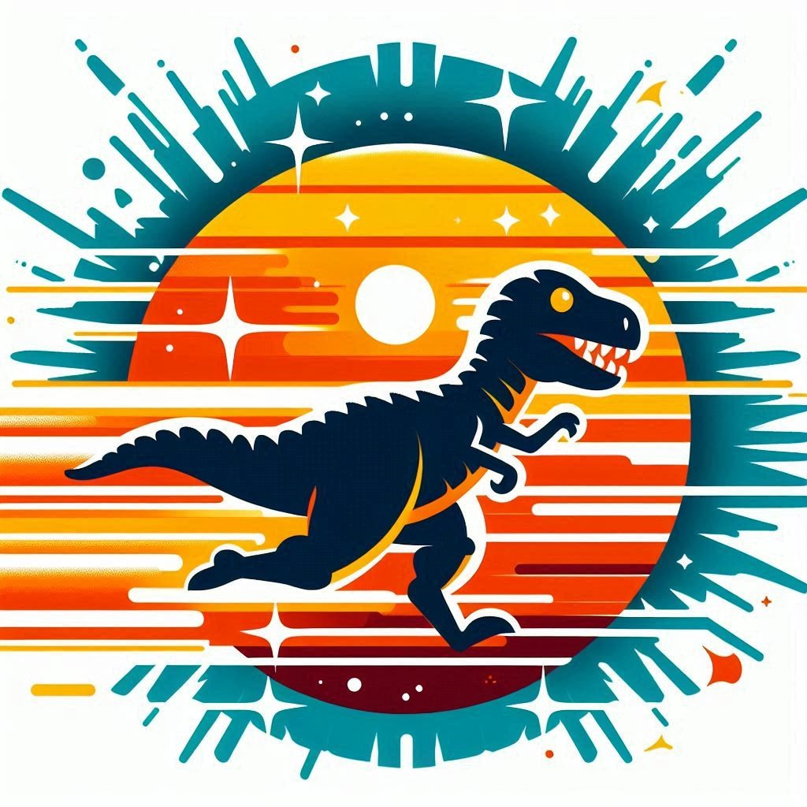

This is an exciting game developed in C++ using SDL2. In this game, the player controls a dinosaur character that can jump to avoid obstacles and collect coins (represented as Sun icons). 

One unique aspect of this game is the introduction of "light time." As the player reaches a certain score, the scene becomes shrouded in darkness, making the obstacles disappear. To navigate through this challenging phase, the dino must collect coins to illuminate the scene temporarily. This adds a strategic element to the gameplay, requiring players to balance their focus between collecting coins and avoiding obstacles.



## Table of Contents 
- [Table of contents](#Table_of_Contents)
- [Features](#Features)
- [Requirements](#Requirements)
- [Installation](#Installation)
- [Usage](#Usage)
- [Game Mechanics](#Game_Mechanics)
- [Code Structure](#Code_Structure)
 
## Features
- Player-controlled character with jump mechanics
- Randomly generated obstacles to avoid
- Collectible coins to increase score
- Difficulty progression over time
- Visual timer indication for active "light time"
- Game over and restart functionality
- Waiting screen with a centered BMP image before the game starts
## Requirements
- SDL2 library
- SDL2_ttf 
- C++11 or higher compatible compiler
## Installation

### Cloning and Building the Game
1. Clone the repository:
```bash
git clone https://github.com/yourusername/SDL2Game.git
cd SDL2Game
```

1. Compile the game:
```bash
make
```

## Usage
Run the compiled game executable:
```bash
./SolarSprint
```

Or double-click on the SolarSprint.exe file if you are on Windows.
## Game Mechanics
### Controls 
- `Space`: Make the player character jump. 
- `Return`: Restart the game after a game over.
### Gameplay
- The player character must jump to avoid obstacles.
- Collect coins to increase the score.
- The game becomes more difficult over a certain score.
- "Light time" indicates a period during which the background changes color.
- The game ends if the player collides with an obstacle.
## Code Structure
### Main Classes 
1. **Game** : Handles the main game loop, event handling, updating, and rendering. 
2. **Player** : Manages the player character's position, input handling, and collision detection. 
3. **Obstacle** : Represents obstacles that the player must avoid. 
4. **Coin** : Represents collectible coins that increase the player's score. 
5. **Text** : Renders text on the screen using SDL_ttf.
### Important Methods 
- **Game::init** : Initializes the game window and renderer, and shows the waiting screen. 
- **Game::handleEvents** : Processes user inputs. 
- **Game::update** : Updates game objects and checks for collisions. 
- **Game::render** : Renders all game objects and handles visual updates. 
- **Game::showWaitingScreen** : Displays a waiting screen with a centered BMP image. 
- **Player::handleInput** : Processes player input for jumping. 
- **Player::update** : Updates the player's position and jump mechanics. 
- **Text::render** : Renders text on the screen.
